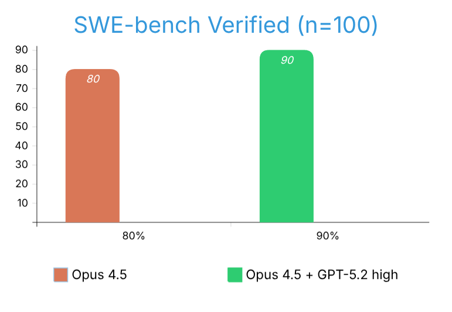

# Claude Opus + Codex Reviewer (100 Verified Instances)

Does adding a Code Reviewer agent improve SWE-bench resolution?



## Results

|                  | Single-Agent | 2-Agent  | Difference |
| ---------------- | :----------: | :------: | ---------: |
| **Resolved**     |     80%      |   90%    |       +10pp |
| **Avg Time**     |   3.5 min    | 7.8 min  |       2.2x |
| **Regressions**  |      —       |    0     |          0 |

- **Single-Agent:** Claude Opus 4.5 (Brainstormer)
- **2-Agent:** Claude Opus 4.5 (Brainstormer) + GPT-5.2 (Code Reviewer)

100 instances from SWE-bench Verified.

## Key Finding

**Zero regressions.** The 2-agent setup never performed worse than solo — it either matched or improved.

## By Repository

| Repository              | Single | 2-Agent | Change |
| ----------------------- | :----: | :-----: | -----: |
| pylint-dev/pylint       |   0%   |  100%   |  +100% |
| sphinx-doc/sphinx       |   0%   |   86%   |   +86% |
| sympy/sympy             |  81%   |   88%   |    +7% |
| django/django           |  91%   |   94%   |    +3% |
| pytest-dev/pytest       | 100%   |  100%   |     0% |
| scikit-learn/scikit-learn | 67%  |   67%   |     0% |

## Structure

```
├── claude-100/           # Single-Agent results
│   ├── results/          # Per-instance results
│   └── ...
└── claude-codex-100/     # 2-Agent results
    ├── results/          # Per-instance results
    └── ...
```

## Methodology

Official SWE-bench protocol — agents receive problem statement and hints only, no test names or patches.
