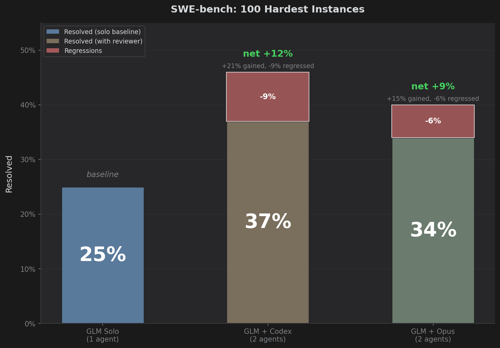

# GLM + Code Reviewer (100 Hard Instances)



## Results

| Config | Resolved | Net vs Solo | Avg Time |
|---|:---:|:---:|:---:|
| **GLM Solo** | 25/100 | — | 8 min |
| **GLM + Codex Reviewer** | **37/100** | **+12** | 12 min |
| **GLM + Opus Reviewer** | 34/100 | +9 | 11.5 min |

- **Brainstormer:** GLM 4.7 (Zhipu AI)
- **Codex Reviewer:** GPT-5.2 (high reasoning)
- **Opus Reviewer:** Claude Opus 4.5

## Improvements vs Regressions

|                | Codex   | Opus |
| Improvements   | 21      |  15  |
| Regressions    | 9       |  6   |
| **Net gain**   | **+12** | +9   |

**5 regressions were shared** between both reviewers, suggesting it's the review loop itself (giving the Brainstormer a chance to overthink) rather than the specific reviewer.

## By Repository

| Repository | Solo | + Codex | + Opus |
|---|:---:|:---:|:---:|
| scikit-learn | 0/3 | **2/3** | **2/3** |
| sphinx-doc | 0/7 | **3/7** | 1/7 |
| xarray | 0/3 | **2/3** | 1/3 |
| django | 12/45 | 15/45 | **16/45** |
| sympy | 4/16 | 5/16 | 5/16 |
| matplotlib | 3/8 | 3/8 | 3/8 |

## Key Findings

1. **Reviewers help more on hard problems** — +12 net gain vs +10 on the Claude test
2. **But hard problems also mean regressions** — the review cycle introduces variation
3. **Codex is aggressive, Opus is conservative** — Codex catches more but also breaks more
4. **GLM + premium reviewer is competitive** — budget model + strong reviewer works

## Structure

```
├── glm-100-unresolv-extra/                # GLM Solo results (baseline)
│   ├── results/
│   └── ...
├── glm-codex-high-unresolved-extra-100/   # GLM + Codex results
│   ├── results/
│   └── ...
└── glm-opus-unresolved-extra-100/         # GLM + Opus results
    ├── results/
    └── ...
```


## Methodology

Official SWE-bench protocol — agents receive problem statement and hints only, no test names or patches.
